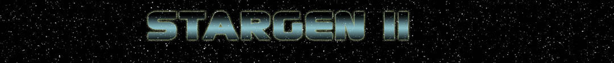

# StarGen II

**StarGen** creates datasheets for realistic solar systems.
It is a C++ Solar-System Generator, based on a random seed, or on real astronomical data from the Celestia database.

Starting with a small amount of information about a star (mass, luminosity and age), Stargen extrapolates the solar system from its initial dust sphere to its accretion into planets, asteroids and atoms. Then it calculates the composition of the planets ground, oceans, atmosphere and climate, using physical laws and the algorithms of the orginal *stargen* program.

It is used for developing space simulation games. 
You can use the executable binary, or include the C++ files into your own programs.

StarGen II is a 2006 fork of Jim Burrows's Stargen (see below).

## Original StarGen

The original *StarGen* code is developed by *Jim Burrows* in *Visual C* and can be found at [eldacur.com](https://eldacur.com/~brons/NerdCorner/StarGen/StarGen.hmtl). 
Stargen is derived from the work of a great number of people over the [past three dozen years](https://github.com/zakski/accrete-starform-stargen). 
It can be use for [Celestia](https://celestia.fr), space games, etc.
A GitHub repository is available [here](https://github.com/grahamreeds/StarGen).

## StarGen 2

Rewritten in C++, *StarGen-II* offers a set of classes that can be used to define the characteristics of solar systems, during the runtime of your application, or in advance using the *command line* program.

The program generate an XML file (or a plain TXT), describing a solar system.

All technical information about how the library works can be found in the [doxygen documentation](https://sphinkie.github.io/StarGen-II/doxygen/html/index.html).

### Output Format

**StarGen-II** generates [XML files](docs/example_xml.md) that can be easily parsed by your software, and [TXT files](docs/example_txt.md) that are more *human-friendly* and contain *comments* (especially *units*).

### Interface with Celestia Catalog

You can associate StarGen-II with the [Celestia](https://celestia.fr) catalog (files are included with Stargen-II). In that case, you can generate solar system datasheets based on real astronomical data.

### Files

* `SG_xxx` files : classes of the *StarGen-II library.*
* `CE_xxx` files : classes for reading the Celestia data files.
* `.dat` files : Celestia data files .
* `stargen.exe` : a command-line executable, that shows how to use the library.

### Usage of stargen.exe

**stargen.exe** is a sample *command-line* program that shows the abilities of the *Stargen-II* library.

* **stargen**		generates a random datasheet
* **stargen 0**		generates a datasheet for the Sol system ( stargen calculation model)
* **stargen 32349**	generates a datasheet for the star with the Catalog Number 32349 (ie: Sirius)
