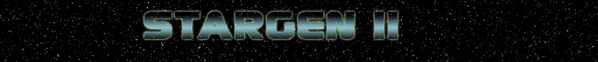

# StarGen-II

*StarGen* creates datasheets for realistic solar systems. 

Starting with a small amount of information about a star (mass, luminosity and age), Stargen extrapolates the solar system from its initial dust sphere, to its accretion into planets, asteroid fields and atoms. Then it calculates the composition of the planets ground, oceans, atmosphere and climate.

It is used for developing space simulation games.

## C++ Library

Rewritten in C++, *StarGen-II* offers a set of classes that can be used to define the characteristics of a solar system, during the runtime of your application, or before with the *command line* program.

The program generates an XML file (and a plain TXT file) describing a **random solar system** (*random seed*), and the **Sol** solar system (*seed 0*). So if the model is *not too bad*, this *0-datasheet* should roughly looks like our solar system.

When using *StarGen* in your program, you generate and then parse the xml file. You can keep the file, so when you need later the same solar system again, you can re-parse the same xml file.

## Output Format

**StarGen-II** generates [XML files](example_xml.md) that can be easily parsed by your software, and [TXT files](example_txt.md) that are more *human-friendly* and contain *comments*, (especially *units*).

## Interface with Celestia Catalog

You can associate StarGen-II with the [Celestia](https://celestia.fr) catalog (files are included with Stargen-II). In that case, you can generate solar system datasheets based on real astronomical data.

## Doxygen Documentation

The C++ classes are explained in the [Doxygen documentation, here.](doxygen/html/index.html)

## Original StarGen

The original *StarGen* code is developed by Jim Burrows in *Visual C* and can be found at [eldacur.com](https://eldacur.com/~brons/NerdCorner/StarGen/StarGen.html).